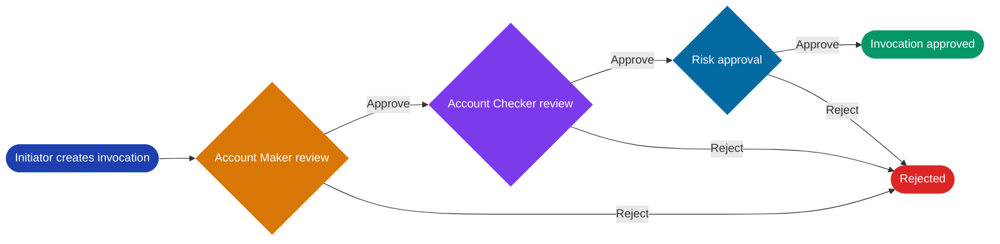

# Aureon Wealth Ops — Collateral Invocation Sandbox

> **Live App:** [View on Vercel](https://manual-invocation-demo.vercel.app)

A fully interactive wealth-management operations sandbox for **pledged securities invocation**. It models how a loan-against-securities desk can create an invocation request, validate it through maker-checker controls, perform risk review, and manage target demat accounts before final execution.

The app is intentionally frontend-only and uses synthetic in-memory data, so anyone can explore the workflow without credentials, seed scripts, or backend setup.

---

## Why This Exists

When a borrower defaults on a loan backed by pledged shares, the lender may need to invoke or claim those securities. In a real institution, that action requires strict operational controls:

- Collateral and loan validation
- Maker-checker approval
- Risk assessment and exception handling
- Demat destination configuration
- Audit-ready status transitions

This project turns that process into a polished product experience that is easy to test and understand.

---

## Product Highlights

- **Executive command center:** Tracks total invocation exposure, approved collateral, pending exposure, risk exceptions, and largest single exposure.
- **Collateral scenario lab:** Lets users experiment with quantity, current market price, haircut, and loan outstanding to understand coverage and escalation bands.
- **Interactive workflow queues:** Requests move live from Initiation to Maker, Checker, Risk, and Approved or Rejected states.
- **Risk scoring:** Risk review uses a transparent score based on quantity, price, product, and concentration-style thresholds.
- **Auto-approval mode:** Low-risk requests can be batch-approved from the Risk queue to demonstrate rule-driven operations.
- **Target DP master:** Users can add, activate, and remove destination demat accounts used for invoked securities.
- **Pre-loaded scenarios:** Example requests are available to demonstrate the full workflow instantaneously.

---

## Workflow



## System Overview

### Core Components

- **Dashboard:** Real-time operations view showing exposure metrics, queue health, and collateral modeling tools.
- **Initiation:** Request creation with structured data capture for client, collateral, loan, and demat details.
- **Maker Review:** First-level validation and approval with document verification context.
- **Checker Review:** Independent four-eye review and secondary approval for risk mitigation.
- **Risk Approval:** Final risk assessment using transparent scoring rules, with auto-approval for low-risk items.
- **Target DP Master:** Demat account lifecycle management (register, activate, retire).

### Data Flow

All state updates occur in real-time across the React Context without requiring backend calls. Requests progress through approval stages, and each transition is immediately reflected across all views. The synthetic dataset includes pre-configured demat accounts and sample client data for rapid exploration.

---

## Usage

The application provides pre-loaded example requests that can be submitted and progressed through the complete approval workflow. Users can:

1. **Analyze metrics** on the Dashboard using the collateral scenario tool to model different haircut and loan levels.
2. **Create and submit** invocation requests with full demat and client context.
3. **Review and approve** requests at each control stage with structured workflows.
4. **Manage demat destinations** for securities transfer.

No authentication or backend infrastructure is required—all logic is client-side.

---

## Domain Concepts

| Term | Meaning |
|---|---|
| **ISIN** | International Securities Identification Number used to identify a listed security |
| **Pledger** | Borrower whose securities are pledged as collateral |
| **Pledgee** | Lender or institution holding the pledge |
| **DP ID / Client ID** | Depository participant and demat account identifiers |
| **CMP** | Current market price of the security |
| **Haircut** | Risk discount applied to collateral value |
| **Coverage ratio** | Post-haircut collateral value divided by loan outstanding |
| **Invocation** | Operational act of claiming pledged securities |
| **Maker-checker** | Dual-control approval pattern used in financial operations |
| **Target DP** | Destination demat account where invoked securities are transferred |

---

## Tech Stack

| Layer | Technology |
|---|---|
| UI | React 19 + Vite |
| Components | Material UI 7 |
| Charts | Recharts |
| Routing | React Router 7 |
| State | React Context API |
| Deployment | Vercel |

---

## Project Structure

```text
src/
├── components/
│   ├── Layout.jsx
│   ├── PageHeader.jsx
│   └── StatusChip.jsx
├── context/
│   └── AppContext.jsx
├── pages/
│   ├── Dashboard.jsx
│   ├── InvocationInitiation.jsx
│   ├── AccountMaker.jsx
│   ├── AccountChecker.jsx
│   ├── RiskApproval.jsx
│   └── TargetDPMaster.jsx
├── mockData.js
├── theme.js
└── main.jsx
```

---

## Running Locally

```bash
npm install
npm run dev
```

Open [http://localhost:5173](http://localhost:5173).

For production verification:

```bash
npm run lint
npm run build
```

---

## Notes

This is a synthetic product sandbox. It does not connect to a real broker, depository, bank, or production loan system, and it does not store personal or financial data.
