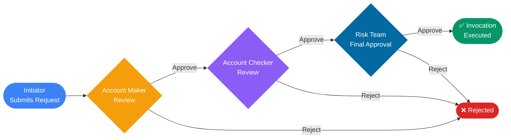
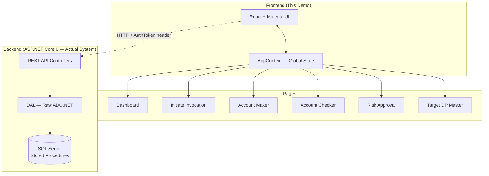
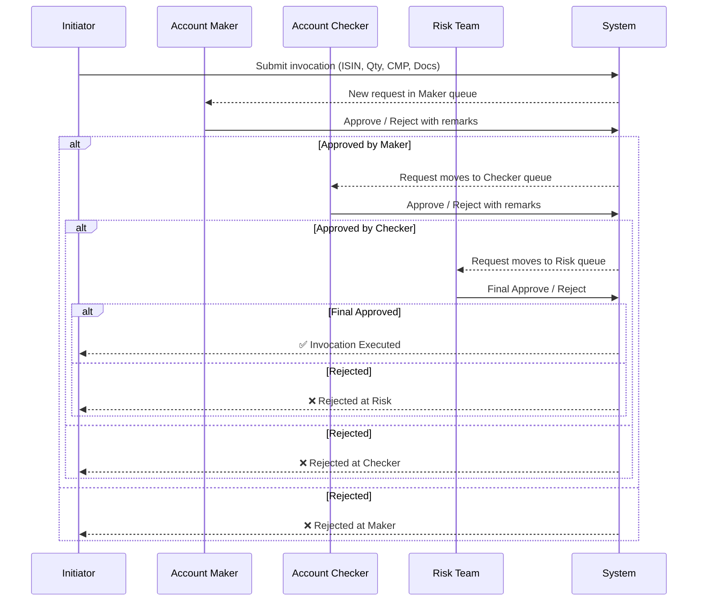

# Manual Invocation — Interactive Demo

> **Live Demo:** [View on Vercel →](https://manual-invocation-demo.vercel.app)

A fully interactive mock demo of a **financial pledge invocation workflow** used by NBFCs and lending institutions in India. Built to demonstrate real-world enterprise fintech UX — no backend, no login required.

---

## What Is Pledge Invocation?

When a borrower takes a loan against pledged shares and defaults, the lender must **invoke** (claim) those shares. This system manages the **Manual Invocation workflow** — the multi-stage approval process that governs this operation.

---

## Approval Workflow



---

## System Architecture



---

## Data Flow



---

## Domain Concepts

| Term | Meaning |
|---|---|
| **ISIN** | International Securities Identification Number — uniquely identifies a stock |
| **Pledger** | The borrower who pledged shares as loan collateral |
| **Pledgee** | The lender (NBFC/bank) holding the pledge |
| **DP ID / Client ID** | Depository Participant ID + account number in CDSL/NSDL |
| **CMP** | Current Market Price of the pledged share |
| **Invocation** | The act of the lender claiming the pledged shares |
| **PSN** | Pledge Sequence Number — unique ID for the pledge transaction |
| **Drawing Power** | Maximum loan amount drawable against the collateral |
| **UTR** | Unique Transaction Reference — bank transaction identifier |
| **Maker-Checker** | Dual-control: one person initiates, another approves |

---

## Tech Stack

| Layer | Technology |
|---|---|
| UI Framework | React 18 + Vite |
| Component Library | Material UI v5 |
| Charts | Recharts |
| Routing | React Router v6 |
| State | React Context API |
| Deploy | Vercel |
| Backend (real system) | ASP.NET Core 6.0 |
| Database (real system) | Microsoft SQL Server + Stored Procedures |
| Auth (real system) | Custom `AuthToken` header → `TOKEN_VALIDATE` SP |

---

## How to Explore the Demo

1. **Dashboard** — See live stats and the workflow guide
2. **Initiate Invocation** → Fill the form and submit a new request
3. **Account Maker** → Approve the request (it moves to Checker)
4. **Account Checker** → Approve again (it moves to Risk)
5. **Risk Approval** → Give final approval (status becomes ✅ Approved)
6. **Target DP Master** → Add/manage destination demat accounts

> All state is live in-memory — approvals in one tab update counts in the sidebar badges immediately.

---

## Project Structure

```
src/
├── context/
│   └── AppContext.jsx        ← Global state (invocations, CRUD, derived views)
├── components/
│   ├── Layout.jsx            ← Responsive sidebar + topbar
│   ├── StatusChip.jsx        ← Colour-coded status badges
│   └── PageHeader.jsx        ← Consistent page headers
├── pages/
│   ├── Dashboard.jsx         ← Stats, charts, workflow guide
│   ├── InvocationInitiation.jsx
│   ├── AccountMaker.jsx
│   ├── AccountChecker.jsx
│   ├── RiskApproval.jsx      ← Risk scoring + auto-approve mode
│   └── TargetDPMaster.jsx
├── mockData.js               ← Seed data (8 requests, 3 target DPs)
└── theme.js                  ← MUI theme (Inter font, custom palette)
```

---

## Running Locally

```bash
npm install
npm run dev
```

Open [http://localhost:5173](http://localhost:5173)

---

*Built as a portfolio demo. The backend (ASP.NET Core + SQL Server) is a separate production system by CYLSYS for FinSmart.*
